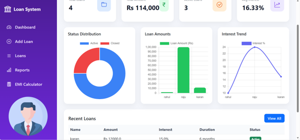
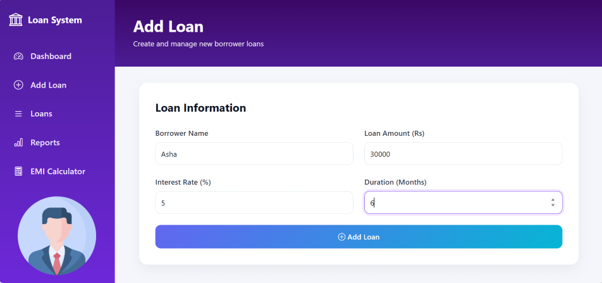
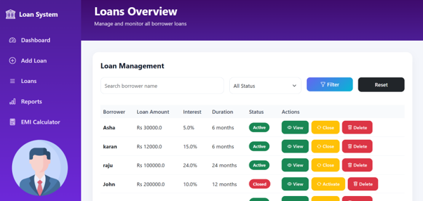
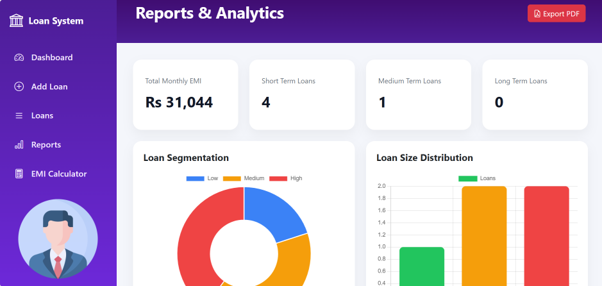
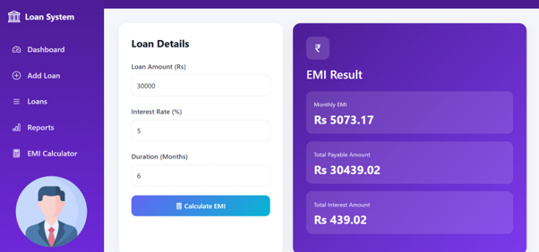
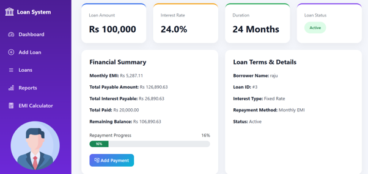
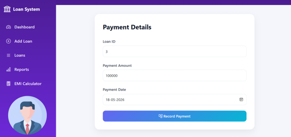

# 💳 Loan Management System

A modern **Loan Management System** built using **Java, JSP, Servlets, JDBC, MySQL, Bootstrap 5, and Chart.js**. The application streamlines loan management by allowing users to add, track, manage, and analyze loans through an intuitive and responsive interface.

---

## 📸 Screenshots

| Dashboard | Add Loan |
|-----------|----------|
|  |  |

| Loan Management | Reports & Analytics |
|----------------|---------------------|
|  |  |

| Loan Overview | EMI Calculator |
|---------------|----------------|
|  |  |

| Payment |
|---------|
|  |

---

## ✨ Features

- 📊 Dashboard with loan analytics
- ➕ Add new loans
- 📋 View and manage loan records
- 🔍 Search and filter loans
- 📈 Reports and graphical analytics
- 🧮 EMI Calculator
- ✅ Activate and close loans
- 🗑️ Delete loan records
- 📱 Fully responsive Bootstrap UI

---

## 🛠️ Tech Stack

- Java
- JSP
- Servlets
- JDBC
- MySQL
- Bootstrap 5
- Chart.js
- Apache Tomcat

---

## 📂 Project Structure

```text
Loan-Management-System/
│
├── src/
│   ├── main/
│   │   ├── java/
│   │   └── webapp/
│
├── loanman.sql
├── README.md
└── pom.xml (if Maven)
```

---

## 🚀 Getting Started

### 1. Clone the Repository

```bash
git clone https://github.com/raahu1l/Loan-Management-System.git
```

### 2. Import the Project

Import the project into:

- Eclipse IDE
- IntelliJ IDEA

### 3. Configure Apache Tomcat

- Install Apache Tomcat
- Add Tomcat Server in your IDE
- Deploy the project

### 4. Create MySQL Database

Create a database in MySQL and import the SQL file.

```sql
loanman.sql
```

### 5. Configure Database Connection

Update your database credentials in:

```
DBConnection.java
```

Example:

```java
private static final String URL = "jdbc:mysql://localhost:3306/loan_management";
private static final String USER = "root";
private static final String PASSWORD = "your_password";
```

### 6. Run the Application

Start Apache Tomcat and open:

```
http://localhost:8080/Loan-Management-System
```

---

## 📌 Modules

### 📊 Dashboard
- Loan statistics
- Active loans
- Revenue overview
- Charts and analytics

### ➕ Add Loan
- Create new loan records
- Validate customer and loan details

### 📋 Loan Management
- View all loans
- Search and filter
- Update loan status
- Delete records

### 📄 Loan Overview
- View detailed loan information
- EMI summary
- Outstanding balance

### 📈 Reports & Analytics
- Loan distribution charts
- Revenue insights
- Loan status analysis

### 🧮 EMI Calculator
- Monthly EMI calculation
- Interest breakdown
- Total repayment amount

### 💳 Payment
- Record loan payments
- Update remaining balance

---

## 🗄️ Database

The application uses **MySQL** as the backend database.

Import:

```
loanman.sql
```

before running the application.

---

## 🌟 Future Improvements

- User Authentication & Role Management
- Email Notifications
- PDF Report Generation
- Loan Approval Workflow
- Export Reports to Excel/PDF
- Payment History
- Dashboard Enhancements

---

## 👨‍💻 Author

**Rahul Walawalkar**

- GitHub: https://github.com/raahu1l

---

## ⭐ Support

If you found this project useful, consider giving it a **⭐ Star** on GitHub!
